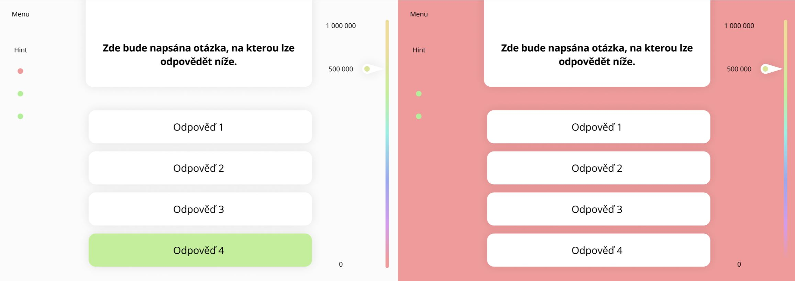
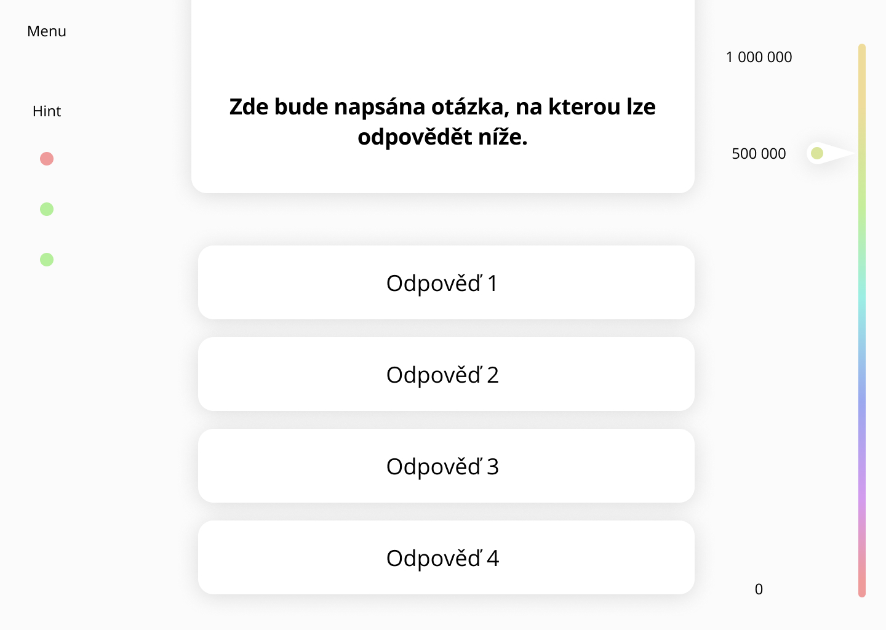

# GAME MOCKUP - MILLIONÁŘ

redesign hry milionář (Who wants to be a millionaire?)

## Pravidla hry

Pravidla jsou snadná. Je položena otázka poouze s jednou správnou odpovědí. Když jí hráč zodpoví správně, postupuje do dalšího kola až se nakonec dopracuje k poslední otázce za 1 000 000 bodů/korun/dolarů. Jestliže zvolí chybnou odpověď prohrává a musí začít od záchyného bodu, které jsou 0, 1000 a 32 000. Otázek je 15 a jejich obtížnost postupem hrou stoupá.

Hráč má 3x možnost nápovědy formou odrstranění 2 chybných otázek a šance zůstane "50 na 50" 
(jako náhradu telefonátu a otázky z publika)

## Hodnoty výher
*Všechny výhry jsou pouze virtuální*

* **otázka 15 - 1 000 000**
* otázka 14 -   500 000
* otázka 13 -   250 000
* otázka 12 -   125 000
* otázka 11 -    64 000
* **otázka 10 -    32 000**
*  otázka 9 -    16 000
*  otázka 8 -     8 000
*  otázka 7 -     4 000
*  otázka 6 -     2 000
* **otázka 5 -     1 000**
*  otázka 4 -       500
*  otázka 3 -       300
*  otázka 2 -       200
*  otázka 1 -       100

## Reakce aplikace na správnou a špatnou odpověd

## Fungování hry

### Úvodní stánka

První stánka slouží pouze jako landing page.
Je zde pouze název hry "Milionář", uprostřed velké tlačítko "Hrát" a ve footeru umístěné tlačítko "O hře", kde budou vysvětleny pravidla hry (viz nadpis "Pravidla hry")

### Menu
Na levé straně tlačítko **"Menu"**, které slouží pro ukončení hry a návratu na landing page.

### Nápověda
Zárověn je zde tlačítko **"Nápověda"** která bude pro ulehčení fungovat jako 3x šance 50:50. To znamená, že po kliknutí na toto tlačítko zmízí polovina odpovědí (nesprávných samozřejmě). Dále také jedna ze tří ikon změní barvu z zelené (#B5EE9B) na červenou (#EE9B9B).

### Otázky
Uprostřed na hlavním panelu bude položena otázka. Otázky mají přidělenou obtížnost, tudíž by měly být pokládány v daném pořadí.

### Odpovědi
Pouze jedna odpověď je správná. Zobrazení odpovědí může být náhodné. 
#### Správná a špatná 
Správně - **tlačítko** zezelená (#B5EE9B)
Špatně - **pozadí stránky** zčervená (#EE9B9B)

### Stupnice výhry
Na pravé straně je ukazatel momentální výhry.
Ikona šipky s číselnou hodnotou se posouvají směrem nahoru.

### Výhra
Hra končí špatnou odpovědí nebo dosažení hodnoty 1 000 000.
Při úspěšném dokončení všech otázek pozadí zezelená. (#B5EE9B) 

